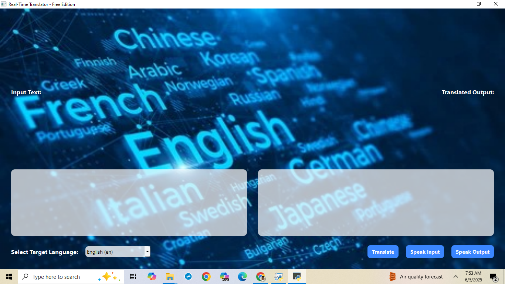

# AI Translator App
A real-time AI-powered language translator desktop application built with "Python" and "PyQt6".  
Supports voice input, text translation, and speech output — all free with no API billing required.

# Features

- Text Input : Type any sentence to translate.
- Voice Input : Speak using your microphone (speech-to-text).
- AI Translation : Translates using `deep-translator` with Google Translate engine.
- Speech Output : Reads the translated text aloud using `pyttsx3`.
- Modern UI : PyQt6 interface with a transparent text layer and custom background.

# Screenshot



# Demo Video 

See how it works: https://drive.google.com/drive/folders/1qjNbAGKC6In4w8i19uqiRt0xsl0vnn8g?usp=drive_link

# Supported Languages

* | Language     | Code |
* |--------------|------|
* | English      | en   |
* | Hindi        | hi   |
* | Telugu       | te   |
* | Tamil        | ta   |
* | Kannada      | kn   |
* | French       | fr   |
* | Spanish      | es   |
* | German       | de   |

# Requirements
Install all dependencies using:

```bash
pip install -r requirements.txt

or manuallu using :
pip install PyQt6 pyttsx3 SpeechRecognition deep-translator pyaudio

# How to run
python translator_app.py
make sure your microphone works and you're connected to the internet.

# Project Structure : 
* AI-Translator-App/
* ├── translator_app.py
* ├── bg.jpg
* ├── Output.png
* ├── Screen recording -Output.mp4
* ├── requirements.txt
* └── README.md

# Author
Developed by Harshith Gunda
No API keys, no billing, fully free & functional.
Gmail : gundaharshith2@gmail.com.
